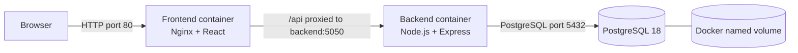
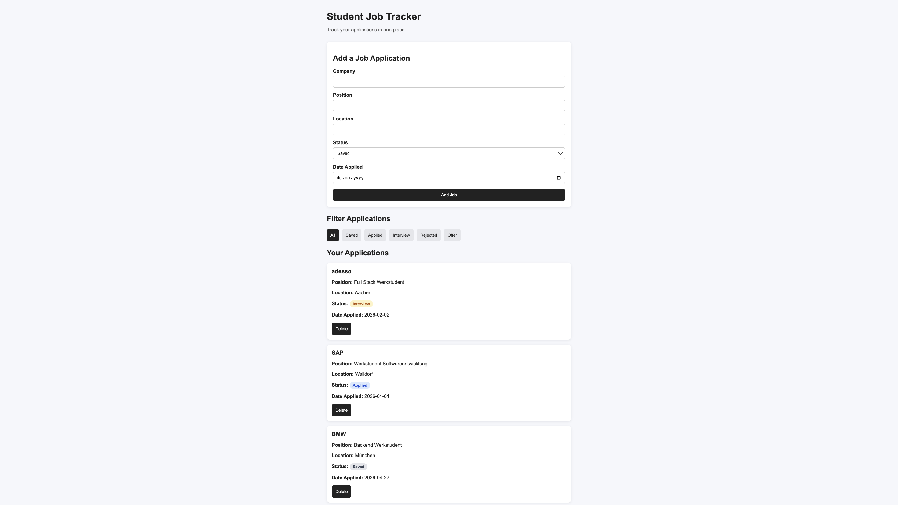

# Student Job Tracker

Full-stack React, Node.js, and PostgreSQL application with a production-oriented DevOps setup using Docker, Docker Compose, Nginx, GitHub Actions, Trivy, and Terraform.

### DevOps highlights

- Three-service Docker Compose architecture
- Nginx reverse proxy with internal backend networking
- PostgreSQL persistence and health checks
- Automated CI with GitHub Actions
- `CRITICAL` vulnerability scanning with Trivy
- Validated AWS infrastructure defined with Terraform

## Architecture



The browser communicates only with Nginx. Nginx serves the React build and proxies `/api` requests across the private Compose network to the backend. The backend connects to PostgreSQL using the Compose service name `db`.

## Features

- Add, view, filter, and delete job applications
- Persist application data across container restarts
- Initialize the database schema automatically on a new volume

## Technology stack

| Area | Technology |
| --- | --- |
| Frontend | React, Vite, JavaScript, CSS |
| Web server and proxy | Nginx |
| Backend | Node.js, Express |
| Database | PostgreSQL 18 |
| Containers | Docker, Docker Compose |
| CI and security | GitHub Actions, Trivy |
| Infrastructure as code | Terraform, AWS provider |

## Docker architecture

Docker Compose defines three services:

| Service | Purpose | Exposure |
| --- | --- | --- |
| `frontend` | Builds React and serves it through Nginx | Host port `80` |
| `backend` | Runs the Express API | Internal port `5050` |
| `db` | Runs PostgreSQL 18 | Internal port `5432` |

The PostgreSQL service uses the `postgres_data` named volume so data survives container recreation. Its health check prevents the backend from starting before the database is ready. The root [`init.sql`](./init.sql) creates the `jobs` table when PostgreSQL initializes a new empty volume.

Nginx serves the React single-page application and forwards `/api/*` to `backend:5050`. The `/api` prefix is removed before the request reaches Express, so `/api/jobs` becomes `/jobs` inside the backend.

## Run locally with Docker Compose

### Prerequisites

- Docker Desktop or Docker Engine with Docker Compose
- Port `80` available on the host

### Start the project

```bash
cp .env.example .env
docker compose up --build -d
docker compose ps
```

Open [http://localhost](http://localhost).

Follow the logs:

```bash
docker compose logs -f
```

Stop the containers while keeping database data:

```bash
docker compose down
```

To remove the containers and permanently delete the local database volume:

```bash
docker compose down -v
```

## Environment variables

Copy `.env.example` to `.env` before using Compose. The real `.env` file is ignored by Git.

| Variable | Purpose |
| --- | --- |
| `POSTGRES_DB` | Database created by the PostgreSQL container |
| `POSTGRES_USER` | PostgreSQL application user |
| `POSTGRES_PASSWORD` | Password shared by PostgreSQL and the backend |

Compose translates these values into the backend's `DB_NAME`, `DB_USER`, and `DB_PASSWORD` variables. It also sets the internal connection values `DB_HOST=db` and `DB_PORT=5432`.

The values in `.env.example` are development examples, not production secrets. Use a unique password for any real deployment and never commit the resulting `.env` file.

## API routes

| Method | Route | Purpose |
| --- | --- | --- |
| `GET` | `/api/jobs` | Return all applications |
| `POST` | `/api/jobs` | Create an application |
| `DELETE` | `/api/jobs/:id` | Delete an application |

These are the browser-facing routes. Nginx removes `/api` before forwarding them to the equivalent Express routes.

## CI and security pipeline

The workflow in [`.github/workflows/ci.yml`](./.github/workflows/ci.yml) runs on every push and pull request:

1. Check out the repository and configure Node.js 22.
2. Install frontend and backend dependencies with `npm ci`.
3. Build the React frontend.
4. Syntax-check the backend entry point and database configuration.
5. Check Terraform formatting, initialize providers without a backend, and run `terraform validate`.
6. Build the frontend and backend images with Docker Compose.
7. Scan both images with Trivy and fail on `CRITICAL` vulnerabilities.

The workflow validates and scans artifacts only. It does not publish images, create cloud resources, or deploy the application.

## Terraform

The configuration under [`infrastructure/terraform`](./infrastructure/terraform) defines:

- One small Ubuntu EC2 instance
- A security group allowing HTTP from the internet
- SSH access restricted to a caller-supplied CIDR
- Variables for AWS region, instance type, EC2 key-pair name, and SSH CIDR
- An output containing the instance public IP

`terraform.tfvars.example` documents safe example inputs. Environment-specific `terraform.tfvars` files are ignored and never used by CI.

Validate the configuration locally:

```bash
terraform -chdir=infrastructure/terraform fmt -check -recursive
terraform -chdir=infrastructure/terraform init -backend=false
terraform -chdir=infrastructure/terraform validate
```

The Terraform configuration is fully designed and validated. Cloud deployment is not included because the available AWS account has organization-level EC2 restrictions.

## Useful commands

```bash
# Build all application images
docker compose --env-file .env.example build

# Start or rebuild the local stack
docker compose up --build -d

# Inspect service state
docker compose ps

# View backend logs
docker compose logs -f backend

# Check the application through Nginx
curl http://localhost/api/jobs

# Build the frontend without Docker
npm --prefix student-job-tracker-frontend ci
npm --prefix student-job-tracker-frontend run build

# Validate backend dependencies and syntax
npm --prefix student-job-tracker-backend ci
node --check student-job-tracker-backend/server.js
node --check student-job-tracker-backend/config/db.js
```

## Screenshots

### Application



## Project structure

```text
.
├── .github/workflows/ci.yml
├── infrastructure/terraform/
├── screenshots/
├── student-job-tracker-backend/
├── student-job-tracker-frontend/
├── .env.example
├── compose.yaml
├── init.sql
└── README.md
```

## Author

Ahmed Mehdi Amar
